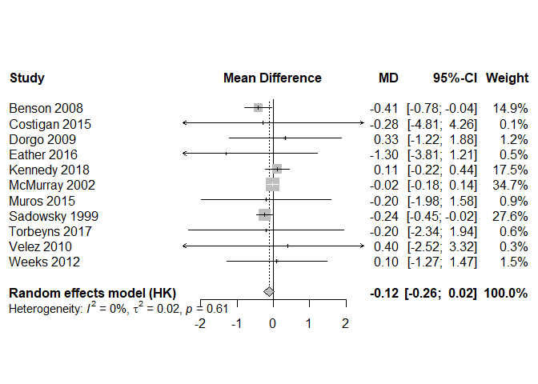

stp25tools
================
2024-06-01

<!--   html_document: -->
<!--     toc: true -->
<!--     toc_float: true -->
<!-- github_document -->
<!-- badges: start -->

[](https://www.tidyverse.org/lifecycle/#experimental)
[](https://CRAN.R-project.org/package=stp25stat2)
<!-- badges: end -->

# Meta-Analyse

Eine Meta-Analyse ist ein statistisches Verfahren, das die Ergebnisse
mehrerer Studien zur gleichen Fragestellung zusammenfasst und daraus ein
aussagekräftigeres Ergebnis errechnet.

- Kombiniert die Ergebnisse von 2 oder mehreren Studien
- Schätzt einen mittleren oder gemeinsamen Effekt
- kontinuierliche Daten: Mittelwert, z-Werte
- dichotome Daten: Anteil, OR, RR

Quelle:
<https://www.gesundheit.gv.at/lexikon/M/lexikon-meta-analyse.html>

## Continuous Outcome Data

The SMD is used in the meta-analysis of continuous data if studies
included in the analysis measured the same outcome but on different
measurement instruments.

The WMD is used in meta-analysis of continuous data if all studies
included in the meta-analysis measured the same outcome on the same
measurement instrument. Tufanaru 2015

Between-Group Standardized Mean Difference (SMD), Cohen’s d

- SMD ≈ 0.20: small effect.
- SMD ≈ 0.50: moderate effect.
- SMD ≈ 0.80: large effect.

Mean difference (MD, or more correctly, ‘difference in means’),

standardized mean difference (SMD)

$g ={\frac{{\bar{x}}_{1}-{\bar{x}}_{2}}{s^{*}}}$

$s^{*}={\sqrt{{\frac{(n_{1}-1)s_{1}^{2}+(n_{2}-1)s_{2}^{2}}{n_{1}+n_{2}-2}}}}$

$d={\frac{{\bar{x}}_{1}-{\bar{x}}_{2}}{{\sqrt{(s_{1}^{2}+s_{2}^{2})/2}}}}$

Andere nicht so oft gebräuchliche Masszahlen: ratio of means (RoM),
minimal important differences (MID)

Folgende Werte sind in den Studien zu finden: mean, standard deviation,
number of participants in each intervention group.

Least squares means (LS Means) are actually a sort of SAS jargon. Least
square means is actually referred to as marginal means (or sometimes
EMM - estimated marginal means).

When a confidence interval (CI) is available for an absolute effect
measure (e.g. standardized mean difference, risk difference, rate
difference), then the SE can be calculated as

$SE=(uper -lower)/3.92$ bei großen Stichproben (n\>60) mit den Werten
99%-CI = 5.15, 95%-CI = 3.92, 90%-CI = 3.29 dere exakte Wert kann
berechnet werden mit pt(1-.95, 60)

$SE = |\frac{MD}{t}|$

within-group SD: $SD = \frac{SE}{\sqrt{n^{-1}_t + n^{-1}_c}}$

$SD = SE\sqrt{N}$

As an example, consider data presented as follows:

| Group                     | Sample size | Mean | 95% CI       |
|---------------------------|-------------|------|--------------|
| Experimental intervention | 25          | 32.1 | (30.0, 34.2) |
| Comparator intervention   | 22          | 28.3 | (26.5, 30.1) |

The SD for this group is $\sqrt{25}\cdot(34.2–30.0)/4.128=5.09$

``` r
sd_from_ci(30.0, 34.2, 25)
```

    ## ci_low ci_hig      n     me     se 
    ##  30.00  34.20  25.00   2.10   1.02 
    ##    se     n    sd 
    ##  1.02 25.00  5.09 
    ## ci_low ci_hig      n     se     sd 
    ##  30.00  34.20  25.00   1.02   5.09

mean difference (MD, or more correctly, ‘difference in means’)
Standardized mean difference (SMD) = Hedges g $SMD= MD/SD$

### Combining groups

sample size $n =n_1 + n_2$

mean $m =  \frac{n_1m_1 + n_2m_2}{n_1 +n_2}$

sd
$sd = \sqrt\frac{(n_1-1)sd^2_1 + (n_2-1) sd^2_2 + \frac{n_1n_2}{n_1+n_2}(m^2_1 - 2m_1m_2+m^2_2)}{n_1 +n_2-1}$

``` r
dat <-
  data.frame(
    author= c("A", "B"),
    cn = c(134, 38),
    cm = c(5.96, 5.34),
    csd = c(4.24, 4),
    
    tn = c(113, 35),
    tm = c(6.82, 6.12),
    tsd = c(4.72, 4.32)
  )

combining(dat)
```

    ##   author  cn    cm    csd  tn     tm    tsd
    ## 1      A 134 5.960 4.2400 113 6.8200 4.7200
    ## 2      B  38 5.340 4.0000  35 6.1200 4.3200
    ## 3   <NA> 172 5.823 4.1846 148 6.6545 4.6238

### Converting Among Effect Sizes

Die Daten müssen genau mit diese Variablen-Namen vorliegen dann können
sie automatisch mit `convert` in MD und SD convertiert werden.

``` r
head(dat_BMI)
```

    ## # A tibble: 6 × 19
    ##      id author  year   tm1  tsd1    tn   tm2  tsd2   cm1  csd1    cn   cm2  csd2
    ##   <int> <fct>  <int> <dbl> <dbl> <int> <dbl> <dbl> <dbl> <dbl> <int> <dbl> <dbl>
    ## 1     1 Benson  2008  24    5.4     31  24    5.5   22.1  3.6     36  22.5  3.5 
    ## 2     2 Costi…  2015  22    4.58    22  22.2  4.5   22.3  4.42    22  22.6  4.34
    ## 3     3 Dorgo   2009  24.5  6.39    93  24.6  6.39  24.9  4.96   129  24.6  4.96
    ## 4     4 Eather  2016  21.6  3       49  21.5  3     20.6  3.7     34  21.7  1.3 
    ## 5     6 Kenne…  2018  21.9  2.14   294  22.0  2.14  22.6  2.34   211  22.6  2.34
    ## 6     7 McMur…  2002  22.5  5.36   319  NA   NA     21.4  4.71   247  NA   NA   
    ## # ℹ 6 more variables: tm <dbl>, tsd <dbl>, cm <dbl>, csd <dbl>, md <dbl>,
    ## #   se <dbl>

``` r
BMI <- convert(dat_BMI)

head(BMI)
```

    ##     author year  cn    cm   csd  tn    tm   tsd     md     sd    se
    ## 1   Benson 2008  36  0.40 0.700  31 -0.01 0.800 -0.410  0.748    NA
    ## 2 Costigan 2015  22  0.34 4.420  22  0.25 4.585 -0.275 15.336 2.312
    ## 3    Dorgo 2009 129 -0.30 4.960  93  0.03 6.390  0.330  5.603    NA
    ## 4   Eather 2016  34  1.10 3.700  49 -0.10 3.000 -1.300 11.661 1.280
    ## 5  Kennedy 2018 211 -0.02 2.340 294  0.09 2.140  0.110  3.775 0.168
    ## 6 McMurray 2002 247  0.23 0.942 319  0.21 0.893 -0.020  0.915    NA
    ##                       type
    ## 1      Exact (Differenzen)
    ## 2          Exact (MD + SD)
    ## 3 Aproximation von MD + SD
    ## 4          Exact (MD + SD)
    ## 5          Exact (MD + SD)
    ## 6      Exact (Differenzen)

``` r
require(meta)
```

    ## Loading required package: meta

    ## Loading required package: metadat

    ## Loading 'meta' package (version 7.0-0).
    ## Type 'help(meta)' for a brief overview.
    ## Readers of 'Meta-Analysis with R (Use R!)' should install
    ## older version of 'meta' package: https://tinyurl.com/dt4y5drs

``` r
m_bmi <- meta::metacont(
  tn, tm, tsd,
  cn, cm, csd,
  sm = "MD",
  studlab = paste(author, year),
  data = BMI
)
m_bmi
```

    ## Number of studies: k = 11
    ## Number of observations: o = 1788 (o.e = 956, o.c = 832)
    ## 
    ##                           MD            95%-CI     z p-value
    ## Common effect model  -0.1072 [-0.2199; 0.0056] -1.86  0.0625
    ## Random effects model -0.1346 [-0.3077; 0.0386] -1.52  0.1277
    ## 
    ## Quantifying heterogeneity:
    ##  tau^2 = 0.0152 [0.0000; 0.1110]; tau = 0.1235 [0.0000; 0.3331]
    ##  I^2 = 0.0% [0.0%; 60.2%]; H = 1.00 [1.00; 1.59]
    ## 
    ## Test of heterogeneity:
    ##     Q d.f. p-value
    ##  8.93   10  0.5390
    ## 
    ## Details on meta-analytical method:
    ## - Inverse variance method
    ## - Restricted maximum-likelihood estimator for tau^2
    ## - Q-Profile method for confidence interval of tau^2 and tau

Workaround da in den Studien auch die exakten Effekte berichtet wurden.

``` r
BMI$md <- ifelse( is.na( BMI$md),  round(m_bmi$TE,2), BMI$md)
BMI$se <- ifelse(is.na(BMI$se ), round(m_bmi$seTE,2) , BMI$se )

m.gen.bmi <- metagen(
  TE = md,
  seTE = se,
  studlab = paste(author, year),
  data = BMI,
  sm = "MD",
  fixed = FALSE,
  random = TRUE,
  method.tau = "REML",
  hakn = TRUE,
  title = "BMI"
)
```

``` r
# Forest plot using JAMA style
#
# settings.meta("JAMA")
#
# settings.meta("RevMan5")
settings.meta(reset =TRUE)
forest(m.gen.bmi,  leftcols = c('studlab'),
       digits.tau2 = 2,
       digits.tau=2,
       xlim=c(-2.5,2.5),
       title = "BMI")
```

<!-- -->

Beim **Fixed-Effect-Modell** geht man davon aus, dass der zugrunde
liegende Effekt in allen Studien gleich ist. Sämtliche Studien liefern
diselben Ergebnisse (same population, they have used the same inclusion
criteria, the treatments have been given in the same way, and outcomes
have been measured consistently.) Beim **Random-effects model** kommt
hingegen eine zusätzliche Variabilität hinzu (heterogenen Effekten).

## Berechnung mit *meta*

| Endpunkt                    | Effektschätzer                             | library(meta)                              |
|-----------------------------|--------------------------------------------|--------------------------------------------|
| binary (2 × 2 table)        | OR, RR, RD (experimental vs control group) | metabin()                                  |
| continuous ( Messwert/Zahl) | MD, SMD, ROM ( SMD = g )                   | metacont() metamean()                      |
| incidence rates             | IR, IRLN, IRS, IRFT                        | metainc( event.e, time.e, event.c, time.c) |
| Korrelation (single)        | ZCOR, COR                                  | metacor()                                  |
| Proportions (single)        | PLOGIT, PFT                                | metaprop( event, n)                        |
| mean (single)               | MRAW, MLN                                  | metamean( n, mean, sd)                     |
| incidence (single)          |                                            | metarate (event, time)                     |

incidence rates = relative Häufigkeit von Ereignissen

## Librarys

    pkgs <- c("mada", "meta", "metafor",
    "metasens", "mvmeta", "netmeta", "rmeta", "ellipse")

    install.packages(pkgs, repos="http://cran.rstudio.com/")
     

- [meta](http://cran.r-project.org/web/packages/meta/index.html) General
  Package for Meta-Analysis

- [mada](http://cran.r-project.org/web/packages/mada/index.html)
  Meta-Analysis of Diagnostic Accuracy

- [metafor](http://cran.r-project.org/web/packages/metafor/index.html)
  General Package for Meta-Analysis

- [metasens](http://cran.r-project.org/web/packages/metasens/index.html)
  Sensitivity Analysis in Meta-Analysis

- [mvmeta](http://cran.r-project.org/web/packages/mvmeta/index.html)
  Meta-Regression. Der Autor hat under dem Linmk
  <http://www.ag-myresearch.com/> **Beispielcode** mit den
  entsprechenden Artikeln.

- [netmeta](http://cran.r-project.org/web/packages/netmeta/index.html)
  Network Meta-Analysis

- [rmeta](http://cran.r-project.org/web/packages/rmeta/index.html)
  Meta-Analysis

### Literatur

Harrer, M., Cuijpers, P., Furukawa, T. A., & Ebert, D. D. (o. J.).
Chapter 3 effect sizes doing meta-analysis in r. Abgerufen 12. Januar
2023, von
<https://bookdown.org/MathiasHarrer/Doing_Meta_Analysis_in_R/effects.html>

dmetar Companion r package for the guide doing meta-analysis in r.
(o.J.). Abgerufen 12. Januar 2023, von <https://dmetar.protectlab.org/>

Tufanaru, C., Munn, Z., Stephenson, M., & Aromataris, E. (2015). Fixed
or random effects meta-analysis? Common methodological issues in
systematic reviews of effectiveness. JBI Evidence Implementation, 13(3),
196. <https://doi.org/10.1097/XEB.0000000000000065>
